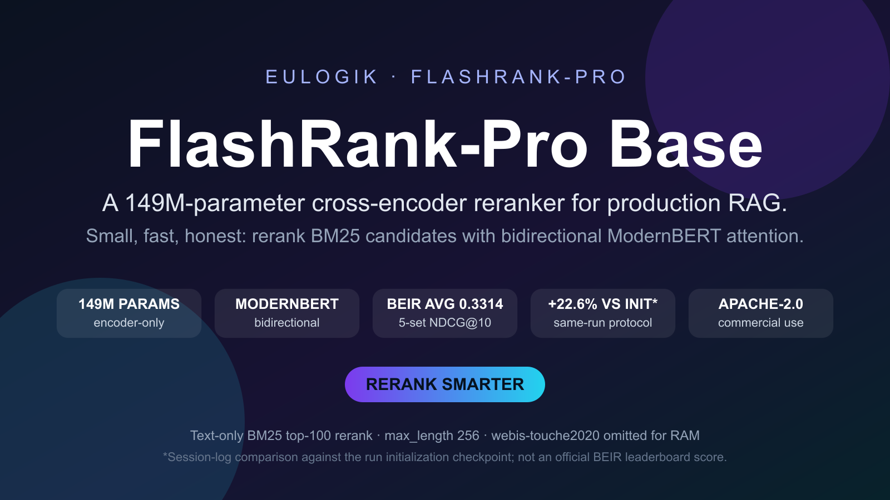
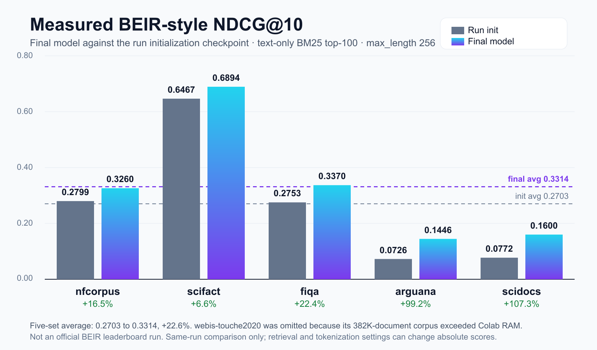
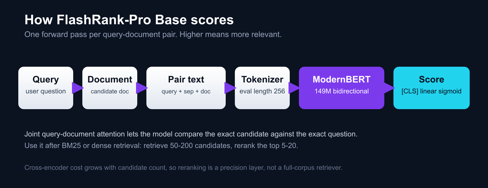
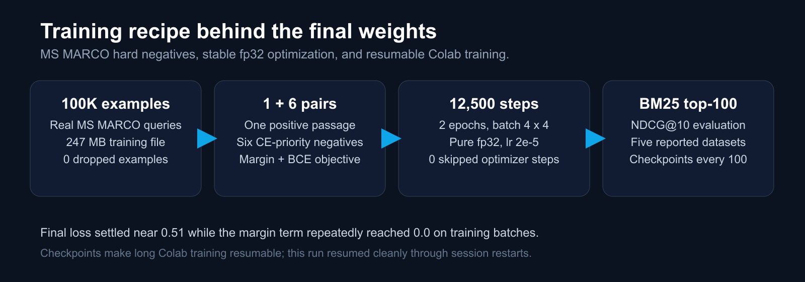

---
language:
- en
license: apache-2.0
library_name: transformers
pipeline_tag: text-classification
base_model: answerdotai/ModernBERT-base
datasets:
- sentence-transformers/msmarco-hard-negatives
tags:
- text-ranking
- reranker
- reranking
- cross-encoder
- modernbert
- retrieval-augmented-generation
- rag
- information-retrieval
- beir
- ms-marco
- apache-2.0
- english
- cpu
---

# FlashRank-Pro Base


[](https://www.apache.org/licenses/LICENSE-2.0)




## Direct answer

**FlashRank-Pro Base is a 149M-parameter ModernBERT cross-encoder that reranks candidate passages for English RAG.** It takes one query plus one candidate document, encodes them jointly, and returns a relevance score between 0 and 1. Use it after BM25 or dense retrieval when you need better top-5 or top-10 precision without a multi-billion-parameter model.

**One-line story:** a small bidirectional reranker learned to separate hard MS MARCO negatives, then improved the weakest retrieval domains the most.

**Find this model with:** `modernbert reranker`, `cross encoder rerank`, `rag reranker`, `beir ndcg at 10`, `cpu friendly reranker`, `apache 2.0 reranker`, `149m reranker`.

## When to use it

| Use FlashRank-Pro Base when | Do not use it when |
|---|---|
| You already retrieve 50–200 candidates with BM25 or embeddings | You need full-corpus retrieval from millions of documents |
| You want stronger top-5/top-10 precision in English RAG | You need multilingual, code, or function-call reranking |
| You want Apache 2.0 commercial use | You need calibrated probabilities for high-stakes decisions |
| You prefer a small CPU-friendly cross-encoder | You need an official BEIR leaderboard submission |

## Quick start

```python
from transformers import AutoModelForSequenceClassification, AutoTokenizer
import torch

model_id = "eulogik/flashrank-pro-base"
model = AutoModelForSequenceClassification.from_pretrained(model_id, trust_remote_code=True)
tokenizer = AutoTokenizer.from_pretrained(model_id)
model.eval()

query = "how to train a neural network"
documents = [
    "Training neural networks requires backpropagation and gradient descent.",
    "Python is a programming language.",
    "The history of ancient Rome is long and complex.",
]

pairs = [query + " </s> " + document for document in documents]
inputs = tokenizer(pairs, truncation=True, max_length=256, padding=True, return_tensors="pt")

with torch.no_grad():
    scores = torch.sigmoid(model(**inputs).logits.float().squeeze(-1)).tolist()

ranked = sorted(zip(documents, scores), key=lambda item: item[1], reverse=True)
print(ranked)
```

## Benchmarks



| Dataset | Run-init checkpoint | Final model | Absolute gain | Relative gain |
|---|---:|---:|---:|---:|
| nfcorpus | 0.2799 | 0.3260 | +0.0461 | +16.5% |
| scifact | 0.6467 | 0.6894 | +0.0427 | +6.6% |
| fiqa | 0.2753 | 0.3370 | +0.0617 | +22.4% |
| arguana | 0.0726 | 0.1446 | +0.0720 | +99.2% |
| scidocs | 0.0772 | 0.1600 | +0.0828 | +107.3% |
| **Five-set average** | **0.2703** | **0.3314** | **+0.0611** | **+22.6%** |

### Evaluation protocol

- Text-only BM25 top-100 retrieval, then rerank with the cross-encoder.
- `max_length=256`, query-batched evaluation.
- `webis-touche2020` was omitted because its 382K-document corpus exceeded Colab RAM.
- Baseline values are the same training run's initialization checkpoint, recorded in the project session log.
- **These are not official BEIR leaderboard numbers.** Retrieval text fields, tokenization, candidate count, and hardware can change absolute scores.

## Architecture



| Model fact | Value |
|---|---|
| Base architecture | `answerdotai/ModernBERT-base` |
| Parameters | Approximately 149M |
| Model type | Cross-encoder, encoder-only, bidirectional |
| Input | Query, separator, and one candidate document |
| Output | Scalar logit converted with sigmoid to a 0-1 relevance score |
| Evaluation length used | 256 tokens |
| Primary language | English |
| License | Apache 2.0 |

The important choice is bidirectionality: query and document tokens attend to each other in the same encoder pass. That is why a 149M cross-encoder can be competitive as a precision layer even though it is much smaller than decoder-only rerankers.

## Training recipe



| Training fact | Value |
|---|---|
| Training examples | 100,000 MS MARCO query-passage examples |
| Pair structure | 1 positive + 6 CE-priority hard negatives per query |
| Objective | Margin ranking loss plus BCE-style score loss |
| Epochs | 2 |
| Optimization steps | 12,500 |
| Effective batch | 16 queries |
| Optimizer settings | AdamW, learning rate 2e-5, weight decay 0.01 |
| Precision | Pure fp32 |
| Margin | 0.15 |
| BCE weight | 0.5 |
| Checkpoints | Every 100 steps, resumable across Colab sessions |
| Skipped optimizer steps | 0 |
| Final training loss | About 0.51 |

## Limitations

- English-focused; multilingual quality was not measured.
- The reported evaluation is a five-set BEIR-style reranking protocol, not the full official BEIR suite.
- Absolute NDCG@10 depends on the retriever, text fields, candidate count, tokenizer length, and hardware.
- Latency, throughput, memory, and energy were not benchmarked in this run; treat “CPU-friendly” as a design goal, not a measured guarantee.
- Sigmoid outputs are ranking scores, not calibrated probabilities.
- Touché-2020 was excluded for memory reasons rather than quality reasons.

## FAQ

### What is FlashRank-Pro Base?

It is an Apache 2.0 ModernBERT cross-encoder for reranking English passages in retrieval-augmented generation.

### How many parameters does it have?

Approximately 149M parameters, based on ModernBERT-base plus a scalar relevance head.

### What data trained it?

100,000 MS MARCO examples with one positive passage and six hard negatives per query.

### How is it different from an embedding model?

An embedding model retrieves candidates independently. This cross-encoder jointly reads one query and one candidate, making it slower but more precise for final ranking.

### Can I use it commercially?

Yes. The model card license is Apache 2.0. Verify the repository license file before production deployment.

### How should I deploy it?

Retrieve 50-200 candidates with BM25 or dense search, rerank them in batches, and keep the top 5-20 for generation.

### What should I measure before trusting it?

Measure NDCG@10 on your own queries, latency per candidate batch on your CPU/GPU, worst-case long-document behavior, and calibration if scores affect decisions.

## Reproduction notes

- Training entry point: `training/05_beir_finetune.py`
- Training notebook: `notebooks/flashrank_beir_finetune_colab.ipynb`
- Data preparation: `scripts/prepare_msmarco_data.py`
- Project decisions and session history: `MEMORY.md`

## License

Apache 2.0. Built on ModernBERT by AnswerDotAI.

**Share line:** `FlashRank-Pro Base: a 149M Apache-2.0 ModernBERT reranker for RAG. Measured 0.3314 five-set NDCG@10 and +22.6% versus its run-init checkpoint. #RAG #reranker #ModernBERT #BEIR #opensource`
